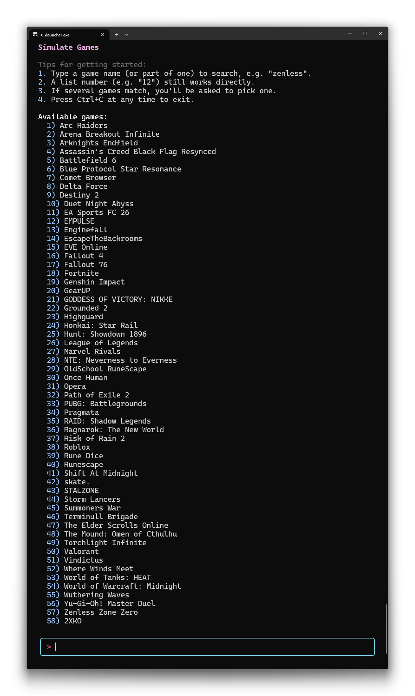

<div align="center">

# Simulate Games

### A fast, terminal-based game activity simulator.

[](#installation)
[](#license)
[]()
[]()

</div>

---

## About

**Simulate Games** is a lightweight, interactive command-line tool that presents a searchable catalog of games and, when one is selected, deploys and launches a small self-contained process representing that game — reproducing the local game-activity footprint that platforms like Discord look for, without requiring the actual game to be installed.

It's built entirely in modern C++ with zero runtime dependencies: the "game" binary is embedded directly inside the launcher executable at build time and extracted on first run.

---

## Preview

<div align="center">
  
</div>

---

## Features

- **Fuzzy search** — type any part of a game's name (e.g. `Roblox`) to find it instantly, with word-start and exact-match scoring
- **Direct index selection** — already know the number? Just type it (e.g. `38`)
- **Smart disambiguation** — multiple matches show a shortlist and let you narrow down further
- **Config-driven catalog** — the full game list, including target folder layout and executable name, lives in a single `info.json` file you can freely extend
- **Custom terminal UI** — hand-rolled colored prompt box with true-color (24-bit) ANSI output, a braille spinner, and dynamic width detection
- **Cross-platform** — a single codebase compiles natively for both Windows and Linux
- **Simple controls** — `Ctrl+C` to exit cleanly at any time, with proper cursor/terminal state restoration

---

## How It Works

1. On launch, `launcher` reads `info.json`, which lists every supported title as `{ name, path, executable }`.
2. You search for or select a game from the terminal UI.
3. The launcher resolves a target directory under `data/<path>/` and checks whether `<executable>` already exists there.
4. If it doesn't, the launcher extracts its embedded payload — a tiny placeholder binary (`dummy_game`) that was baked into the launcher at build time — and writes it to that path.
5. The extracted binary is launched as its own process with the correct working directory, simulating the presence and execution of the selected game.

---

## Installation

### Prerequisites

- CMake 3.15+
- A C++23-capable compiler:
  - **Linux:** GCC or Clang
  - **Windows (native):** MSVC (Visual Studio) or a native MinGW-w64/MSYS2 toolchain
  - **Windows (cross-compiled from WSL/Linux/macOS):** MinGW-w64 (`mingw-w64` package)

### Build from source

The project ships with CMake presets for both targets:

```bash
git clone https://github.com/xorberto/simulate-games.git
cd simulate-games
```

**Linux:**
```bash
cmake --preset linux-release
cmake --build --preset linux-release
```
The resulting `launcher` binary and `info.json` will be in `build/linux/Release/`.

**Windows (native, using MSVC or a native MinGW-w64 toolchain):**
```bash
cmake --preset windows-native-release
cmake --build --preset windows-native-release
```
The resulting `launcher.exe` and `info.json` will be in `build/windows-native/Release/`. Both `launcher.exe` and the embedded `dummy_game.exe` are statically linked (via `/MT` on MSVC, or `-static` on MinGW-w64), so no separate runtime redistributable is required on the target machine.

**Windows (cross-compiled from WSL/Linux/macOS with MinGW-w64):**
```bash
cmake --preset windows-release
cmake --build --preset windows-release
```
The resulting `launcher.exe` and `info.json` will be in `build/windows/Release/`.

### Prebuilt binaries

Prebuilt `simulate-games-linux.zip` and `simulate-games-windows.zip` packages are published automatically on tagged releases — see the [Releases](../../releases) page.

---

## Usage

1. Run `launcher` (Linux) or `launcher.exe` (Windows) from a folder containing `info.json`.
2. Type a game name (or part of one) to search, e.g.:
   ```
   > Roblox
   ```
3. Or type a list number directly to select instantly:
   ```
   > 38
   ```
4. If multiple games match your search, pick one from the shortlist shown.
5. Press `Ctrl+C` at any time to exit safely.

---

## Configuration

Every entry in `info.json` follows this shape:

```json
{
  "name": "Genshin Impact",
  "path": "Genshin Impact\\Genshin Impact game",
  "executable": "GenshinImpact.exe"
}
```

- `name` — what's shown in the catalog and matched against search queries
- `path` — subfolder under `data/` where the deployed binary will live
- `executable` — filename the extracted binary is written as

Add, remove, or edit entries to customize the catalog to your needs.

---

## Contributing

Contributions are welcome! If you'd like to add support for a new game, fix a bug, or improve the tool:

1. Fork the repository
2. Create a feature branch (`git checkout -b feature/new-game-support`)
3. Commit your changes
4. Open a Pull Request

---

## License

This project is licensed under the GNU General Public License v3.0. See the [LICENSE](LICENSE) file for details.

---

## Disclaimer & Limitation of Liability
**This tool is provided for educational and research purposes only.**

By using this software, you acknowledge and agree to the following:

* **No Affiliation:** This project is not affiliated with, endorsed by, or supported by Discord, any game developers, or their respective parent companies.
* **Risk of Use:** Use of automation tools, "quest completers," or software that simulates user behavior may violate **Discord's Terms of Service (ToS)**. Use of this program may result in account warnings, temporary suspensions, or permanent bans.
* **No Warranty:** This software is provided "as is," without warranty of any kind, express or implied. The author(s) make no guarantees regarding the safety, functionality, or continued compatibility of this tool.
* **Limitation of Liability:** In no event shall the author(s) or copyright holders be held liable for any claims, damages, account losses, or other consequences arising from the use, inability to use, or the "misuse" of this software.
* **User Responsibility:** You are solely responsible for your own actions and any consequences that arise from running this executable.

**If you do not agree to these terms, do not download, install, or run this software.**